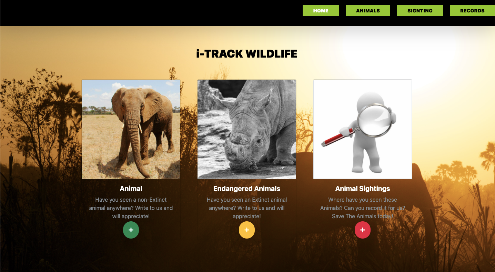
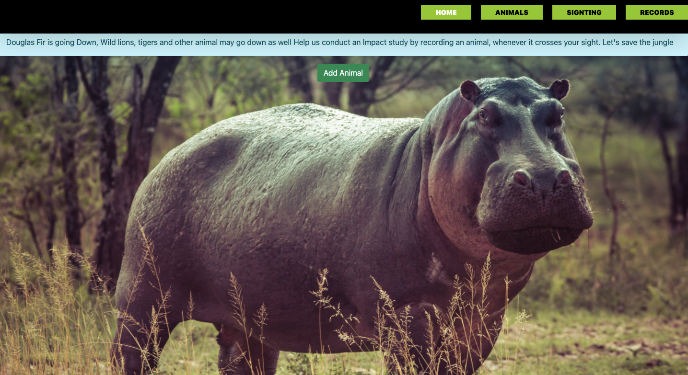
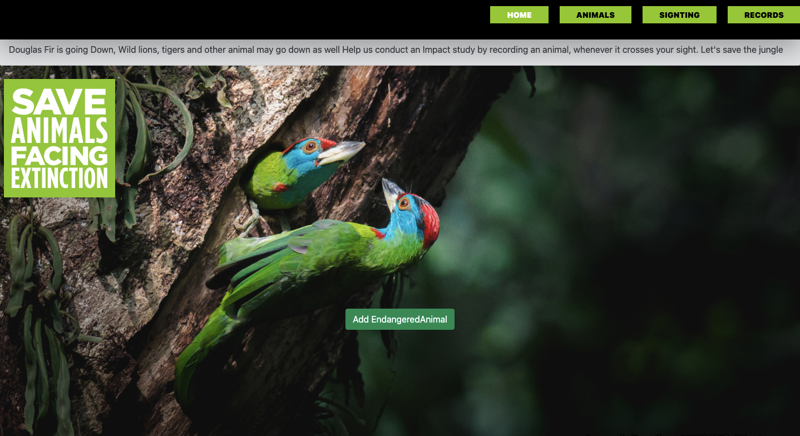
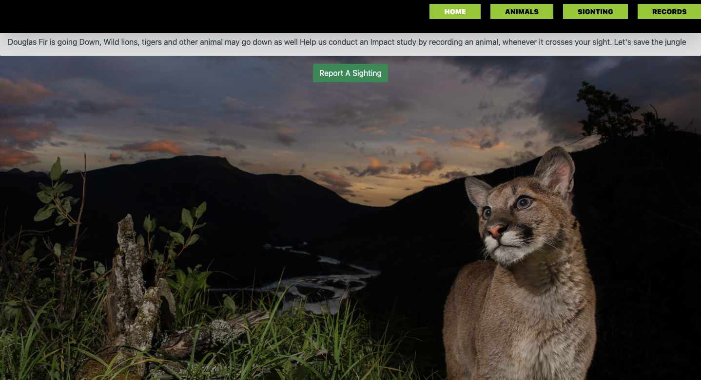
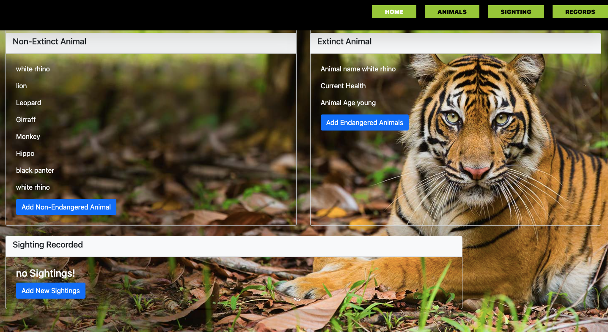

# Track Wildlife
#### Track Wildlife, February 14th 2022
#### By **Mohamed Ibrahim**





## Description

```bash
An application that allows Rangers to track wildlife sightings in the area.
```

## TOC

- [Installation](#Installation)
- [SQL](#SQL)
- [Tests](#Tests)
- [Live Demo](#Tests)
- [Requirements](#Requirements)
- [Known Bugs](#Requirements)
- [Extras](#extras)


## Technologies Used


## Installation
* `git clone <https://github.com/moemaair/Track-wildlife-.git>` this repository
* `cd Track-wildlife`


## Live Demo
To view the page click on the link below
 [https://ibrahim-track-wildlife.herokuapp.com/](*)


## SQL
```bash
1.Launch postgres

2.Type in psql

Run these commands

3. CREATE DATABASE wildlife_tracker;

4. \c wildlife_tracker;

5. CREATE TABLE animals (id serial PRIMARY KEY, name varchar, health varchar, age varchar, type varchar);

6. CREATE TABLE wildlife_tracker=# CREATE TABLE sightings (id serial PRIMARY KEY, animal_id int, location varchar, ranger_name varchar, timestamp timestamp);

7. CREATE DATABASE wildlife_tracker_test WITH TEMPLATE wildlife_tracker;

```
## Requirements
```bash
The applications allow users to do the following:

1.Add a new animal
 
2.Add an endangered animal

3.Add an animal Sighting

```

## Known Bugs
- Quick note that The page loads a bit slow due to the hosting, kindly be a little patient everything works just fine.
- There are currently no tests done for this project.
- As at the time this project was made, responsiveness was not a major concern 
- The project is currently not being maintained any more 


## Contact Details
```bash
You can contact me at rageali12@@gmail.com
```

## License
- This project is licensed under the MIT Open Source license Copyright (c) 2022. 

[](https://twitter.com/codingin254)
